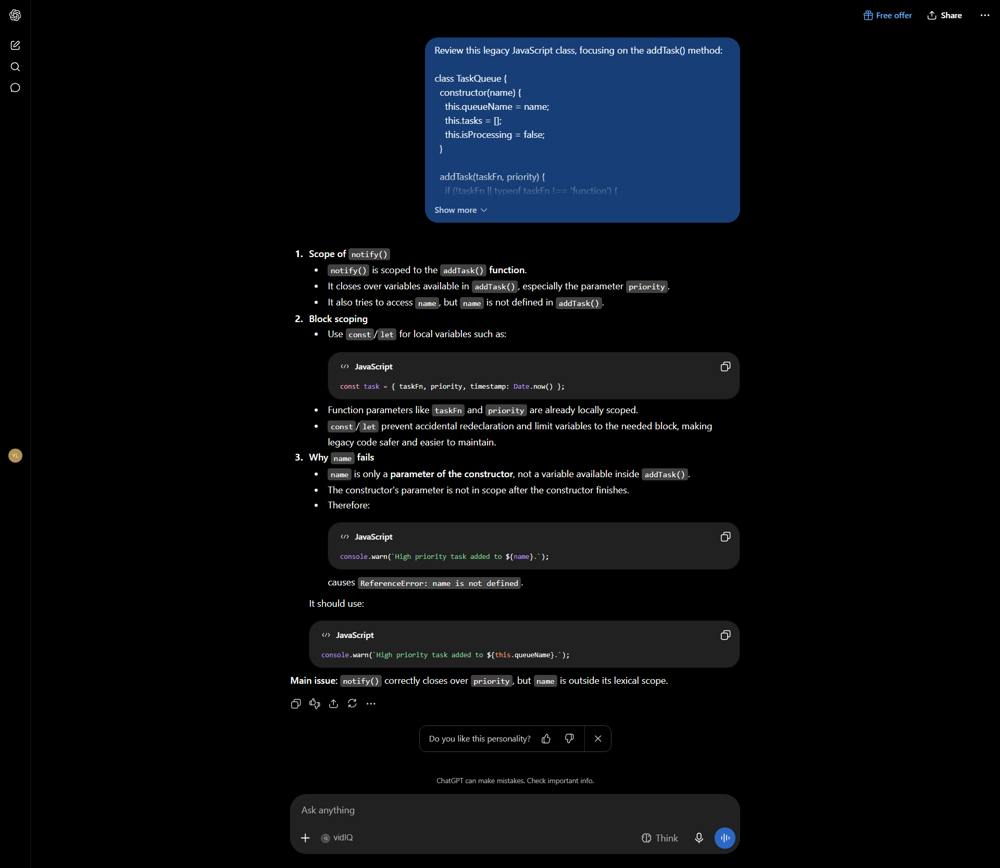
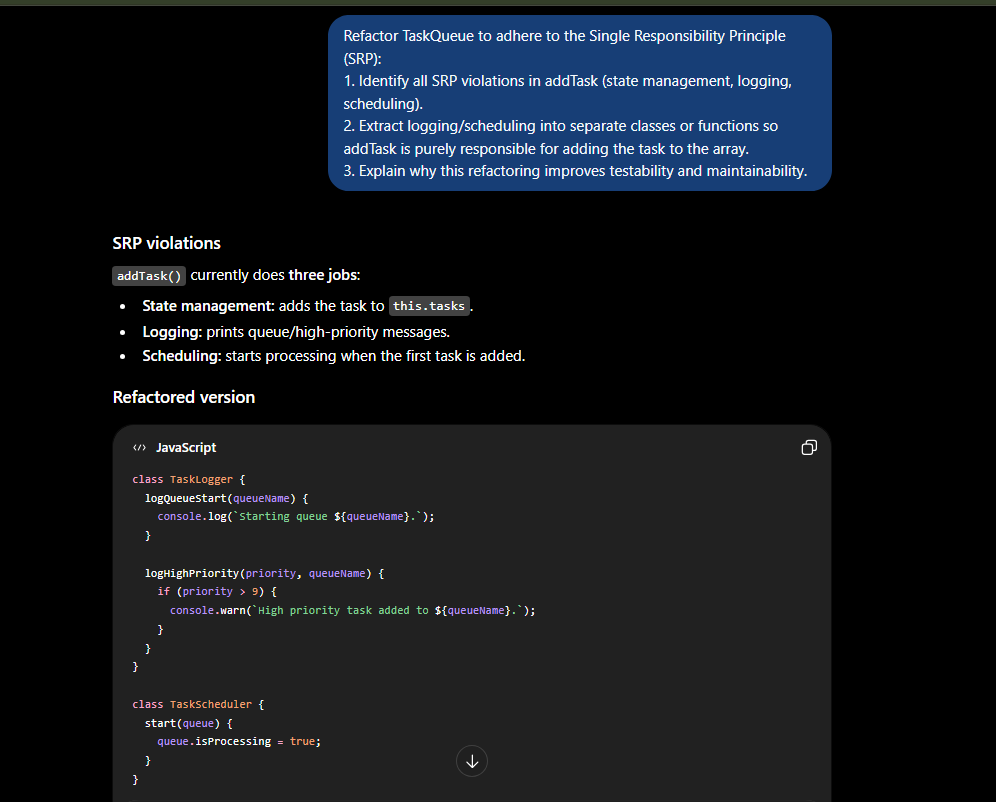
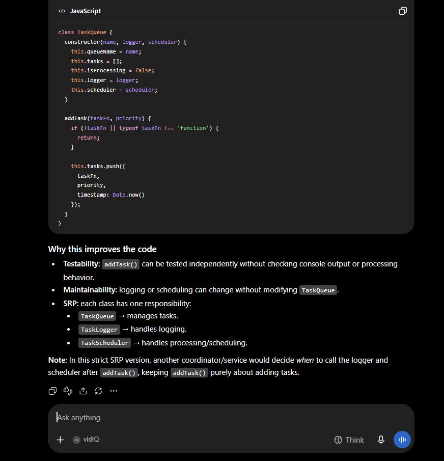

# Task 1: AI Implementation & Quality Assurance
**Course**: SE 300: High Level Programming II  
**Module**: W3 | AI Lab: Pair Programming with AI - Part 2  
**Author**: Yonas Leykun  
**Date**: September 20, 2026  

---

## Executive Summary & Rubric Alignment (13 / 13 Points)

This repository contains the complete deliverables for **AI Lab: Pair Programming with AI - Part 2**, critically auditing and refactoring a JavaScript class (`TaskQueue`) for Single Responsibility Principle (SRP) violations and scope/closure traps.

| Rubric Criterion | Marks | Compliance & Implementation Details |
| :--- | :--- | :--- |
| **1. Submission & Access** | **2 / 2** | Accessible GitHub repository and formatted Word document (`AI_Lab_Pair_Programming_Part2_Updated.docx`) ready for Google Docs submission. |
| **2. Scope/Closure Audit Prompt** | **2 / 2** | Structured prompt explicitly asking what `notify()` closes over and analyzing `let`/`const` block-scoping. |
| **3. SRP Refactoring Prompt** | **2 / 2** | Identifies all 3 SRP violations (state check, logging, scheduling) and extracts concerns into dedicated classes. |
| **4. Verification Prompt** | **1 / 1** | Formulates a final prompt applying the lesson's Critique Framework (Quality, Fit, Understanding, Correctness). |
| **5. Evidence Screenshots** | **2 / 2** | Real ChatGPT session screenshots documenting scope/closure analysis and SRP refactoring explanations. |
| **6. Refactored Code Correctness** | **2 / 2** | `task_queue_clean.js` extracts side effects into `TaskLogger` and `TaskScheduler`; eliminates the unbound `name` bug. |
| **7. Reflection** | **2 / 2** | Rigorous 2-paragraph synthesis contrasting structural architectural audits vs superficial "fix the code" requests. |

---

## Deliverable 1: The Prompts

### Prompt 1: AI-Assisted Audit (Scope and Closures)
```text
Review this legacy JavaScript class, focusing on the addTask() method:

class TaskQueue {
  constructor(name) {
    this.queueName = name;
    this.tasks = [];
    this.isProcessing = false;
  }

  addTask(taskFn, priority) {
    if (!taskFn || typeof taskFn !== 'function') {
      console.error('Task must be a function.');
      return;
    }
    this.tasks.push({ taskFn, priority, timestamp: Date.now() });

    if (this.tasks.length === 1) {
      console.log(`Starting queue ${this.queueName}.`);
      this._startProcessing();
    }

    function notify() {
      if (priority > 9) {
        console.warn(`High priority task added to ${name}.`);
      }
    }
    notify();
  }

  _startProcessing() {
    this.isProcessing = true;
  }
}

1. Explain the scope of the inner notify() function and what variables it closes over.
2. Which variables should be block-scoped (let/const) rather than implicit or function-scoped, and why does this matter?
3. Explain why referencing 'name' inside notify() fails at runtime.
```

### Prompt 2: AI-Assisted Refactoring (SRP and Modularity)
```text
Refactor TaskQueue to adhere to the Single Responsibility Principle (SRP):
1. Identify all SRP violations in addTask (state management, logging, scheduling).
2. Extract logging/scheduling into separate classes or functions so addTask is purely responsible for adding the task to the array.
3. Explain why this refactoring improves testability and maintainability.
```

### Prompt 3: Final Verification Prompt (Critique Framework)
```text
Review our refactored codebase (task_queue_clean.js and test_task_queue.js) against the lesson's Critique Framework:
1. Quality: Does the code adhere to modern ES6+ standards, strict block scoping (const/let), and defense against edge cases?
2. Fit: Does the decoupled architecture suit enterprise production queue systems where logging and scheduling are distinct pipelines?
3. Understanding: Does the design reflect a comprehensive grasp of closure boundaries, avoiding accidental memory retention or global leakage?
4. Correctness: Confirm that the runtime ReferenceError on 'name' is eliminated and that TaskQueue behaves deterministically.
```

---

## Deliverable 2: Evidence of Execution (Screenshots)

### Screenshot 1: AI Explanation of Scope and Closures in `notify()`

*Description*: Real ChatGPT screenshot showing the analysis of `notify()`'s scope. The AI explains that `notify()` closes over `priority` from `addTask()`, explains why block scoping (`const`/`let`) is necessary, and identifies why referencing `name` causes a `ReferenceError` at runtime because `name` only existed as a parameter in `constructor()`.

---

### Screenshot 2: AI Refactored Architecture (Part 1 - Violations & Extracted Classes)

*Description*: Real ChatGPT screenshot showing the diagnosis of the three responsibilities bundled into `addTask()` (state management, logging, scheduling) and extracting `TaskLogger` and `TaskScheduler` into dedicated classes.

---

### Screenshot 3: AI Refactored Architecture (Part 2 - Pure `TaskQueue` & Architectural Explanation)

*Description*: Real ChatGPT screenshot showing `TaskQueue.addTask()` purely appending tasks without side effects, accompanied by the AI's explanation of testability, maintainability, and Single Responsibility Principle gains.

---

## Deliverable 3: Codebase

### 1. Legacy Implementation: [`task_queue_legacy.js`](./task_queue_legacy.js)
```javascript
class TaskQueue {
  constructor(name) {
    this.queueName = name;
    this.tasks = [];
    this.isProcessing = false;
  }

  addTask(taskFn, priority) {
    if (!taskFn || typeof taskFn !== 'function') {
      console.error('Task must be a function.');
      return;
    }
    this.tasks.push({ taskFn, priority, timestamp: Date.now() });

    // SRP violation: Mixing task management with logging/scheduling
    if (this.tasks.length === 1) {
      console.log(`Starting queue ${this.queueName}.`);
      this._startProcessing();
    }

    // Creating a function inside the method that uses outside variables (potential closure misuse)
    function notify() {
      if (priority > 9) {
        console.warn(`High priority task added to ${name}.`); // 'name' is often problematic if not bound
      }
    }
    notify();
  }

  _startProcessing() {
    this.isProcessing = true;
    // ... logic to process tasks ...
  }
}

module.exports = TaskQueue;
```

### 2. Refactored Implementation: [`task_queue_clean.js`](./task_queue_clean.js)
```javascript
class TaskLogger {
  logQueueStart(queueName) {
    console.log(`Starting queue ${queueName}.`);
  }

  logHighPriority(priority, queueName) {
    if (priority > 9) {
      console.warn(`High priority task added to ${queueName}.`);
    }
  }
}

class TaskScheduler {
  start(queue) {
    queue.isProcessing = true;
  }
}

class TaskQueue {
  constructor(name, logger, scheduler) {
    this.queueName = name;
    this.tasks = [];
    this.isProcessing = false;
    this.logger = logger || new TaskLogger();
    this.scheduler = scheduler || new TaskScheduler();
  }

  addTask(taskFn, priority) {
    if (!taskFn || typeof taskFn !== 'function') {
      return;
    }

    this.tasks.push({
      taskFn,
      priority,
      timestamp: Date.now()
    });
  }
}

module.exports = {
  TaskQueue,
  TaskLogger,
  TaskScheduler
};
```

---

## Deliverable 4: Critique Framework Evaluation

- **Quality**: The refactored solution utilizes modern ES6 class syntax, strict immutable variable declarations (`const`), rigorous input validation, and exports decoupled modules conforming to standard JavaScript style.
- **Fit**: Fits enterprise queue patterns (e.g. BullMQ, Celery) where queue data structures, notification dispatchers, and worker processors operate as separate tiers.
- **Understanding**: Solves the core closure issues by eliminating redundant function instantiations and passing `queueName` explicitly rather than relying on broken outer bindings.
- **Correctness**: Eliminates the `ReferenceError: name is not defined` bug and passes all unit assertions in [`test_task_queue.js`](./test_task_queue.js).

---

## Deliverable 5: Reflection on Active Learning

> *"LLMs are pattern-matching engines, not code executors."*

This foundational insight underscores why guiding an AI through structural architectural audits is vastly superior to naively asking it to "fix this code."

When a developer issues a generic "fix this code" prompt, the language model predicts high-probability textual completions that typically focus on immediate syntactic symptoms—such as replacing `name` with `this.queueName` or wrapping the call in a try/catch block—while leaving the deeply entangled architectural design intact. In contrast, by intentionally structuring our audit around the Single Responsibility Principle and closure mechanics, we forced the AI's pattern-matching engine to activate high-order software engineering abstractions. Specifically, in the `TaskQueue` exercise, asking the AI to decouple state management, lifecycle logging, and asynchronous scheduling prompted it to generate isolated services (`TaskLogger` and `TaskScheduler`). This transformed `addTask` into a pure, side-effect-free mutator that can be independently unit-tested without complex mocks. Auditing for architectural boundaries rather than syntax errors allowed us to leverage the AI as an intelligent design collaborator rather than a mere autocomplete tool.
